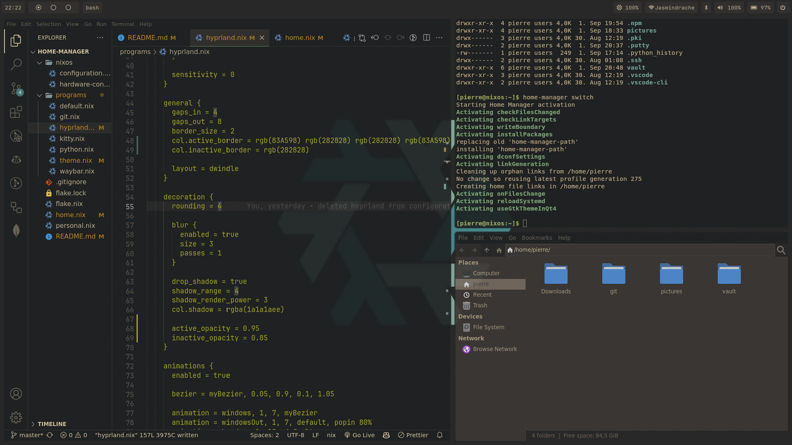
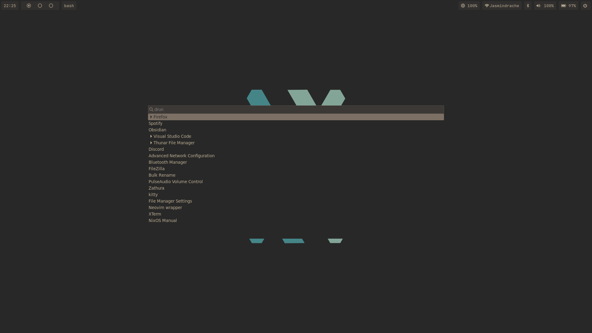
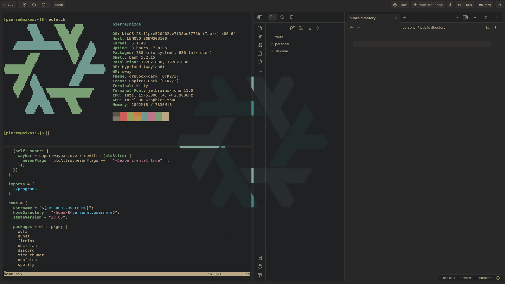

# My minimal NixOS configuration

- **Window Manager**: Hyprland
- **Shell**: bash
- **Terminal**: Kitty
- **Panel**: Waybar
- **Notification Daemon**: Dunst
- **Launcher**: Wofi
- **File Manager**: Thunar

I am new to NixOS and this is my first attempt at creating a nice and minimal configuration. Prior to this I only used ubuntu without much of a configuration.

The intention of this repository is to have a backup of my configuration and show how I set up my system. I am not an expert in NixOS and I am sure there are better ways to do things. If you have any suggestions, please let me know. 

## Usage

I can't provide a full on explanation on how to use this configuration from scratch. That is soon to come though. 

Basically the files in the `nixos` directory are the ones that go into `/etc/nixos/`. The rest of the files go in `.config/home-manager`.

Create a `personal.nix` file that looks like this:

```nix
{
  username = "<username>";
  gitusername = "<gitusername>";
  gitemail = "<gitemail>";
}
```

When applying system wide changes to my `configuration.nix` I run:

```bash
sudo nixos-rebuild switch
```

When applying changes to my user configuration I run:

```bash
home-manager switch
```

## Keybindings

- **Super + Return**: Open terminal
- **Super + Space**: Open launcher
- **Super + E**: Open file manager
- **Super + Q**: Close window
- **Super + S**: Take screenshot

## Screenshots







